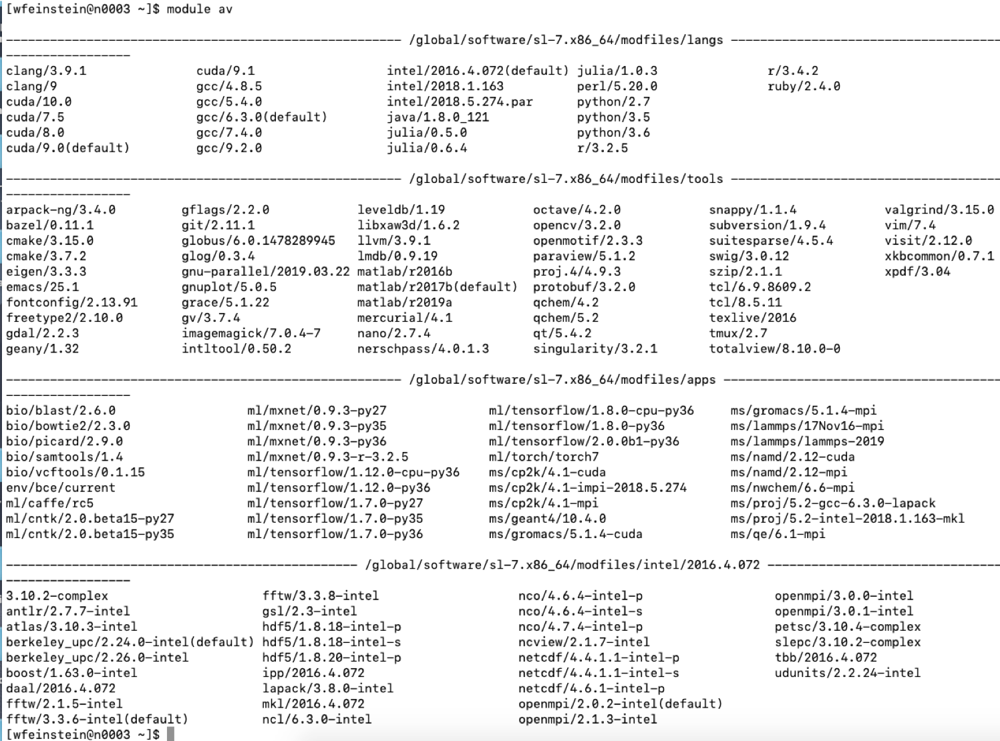

% Container 101 on Lawrencium
% June 10, 2020
% Wei Feinstein

# Outline
- Lawrencium Supercluster overview 
- Lawrencium resources & services  
- Container technology overview
- How to build singularity containers
- How to run singularity containers on Lawrencium

# Lawrencium Cluster Overview
<center></center>

# Lawrencium Condo Cluster
- Lawrencium is a LBNL Condo Cluster Computing resources
    - Significant investment from LBNL
    - Individual PIs purchase nodes and storage
    - Computational cycles are shared among all lawrencium users
- Share the same supercluster infrastructure: 
    - OTP authentication
    - High speed infiniBand parallel file system for fast inter-node communication
    - OS and security updates, software module farm, job scheduler SLURM
    - Home/project storage, lustre parallel file system and backend network infrastructure.

# Three types of Project Accounts
- PI Computing Allowance (PCA) account: free 300K SUs per year (pc_xxx)
- Condo account: 
    - PIs purchase and contribute compute nodes to the general condo pool (lr_xxx)
    - Run jobs within their condo contributions for free 
- Recharge account: with minimal recharge rate ~ $0.01/SU (ac_xxx)
- $25 per user per month 
- Refer to detailed information at [here](https://sites.google.com/a/lbl.gov/hpc/getting-an-account
)

## User accounts
- User account request
- User agreement consent 
- Check [here](https://sites.google.com/a/lbl.gov/hpc/getting-an-account
) for details

# Softwre Module Farm 
<center></center>

# Module commands
- *module purge*: clear user’s work environment
- *module availablev: check available software packages
- *module load xxx*: load a package
- *module list*: check currently loaded software 
- Users may install their own software
- More [information](https://sites.google.com/a/lbl.gov/high-performance-computing-services-group/getting-started/sl6-module-farm-guide)

# Jub Submission
- sbatch: submit a job to the batch queue system
```
sbatch myjob.sh
```
- srun: request an interactive node(s) and login automatically
```
srun -A ac_xxx -p lr5 -q lr_normal -t 1:0:0 --pty bash
```
- salloc : request an interactive node(s)
```
salloc –A pc_xxx –p lr6 –q lr_debug –t 0:30:0
```

# Job Monitoring
- sinfo:view information about partitions and nodes (idle, allocated, drain, down ) 
 ```
 sinfo –r –p lr6
 ```
- squeue: check the current jobs in the batch queue system
```
squeue –u $USER
```
- sacct: information on jobs
```
sacct -X -o ‘jobid,user,partition,nodelist,stat’
```
- scancel : cancel a job
```
scancel jobID
```
- More [information](https://sites.google.com/a/lbl.gov/high-performance-computing-services-group/scheduler/slurm-usage-instructions)

# Resources
- Data Transfer node lrc-xfer.lbl.gov
    - scp -r your/source/file  $USER@lrc-xder.lbl.gov:/cluster/path
	  - rsync -avzh   your/source/file $USER @lrc-xfer.lbl.gov:/cluster/path
- Globus Online provide secured unified interface for data transfer
    - endpoint lbn#lrc, Globus Connect, AWS S3 connect
- Visualization and remote desktop
    - Detailed [information](https://sites.google.com/a/lbl.gov/high-performance-computing-services-group/getting-started/remote-desktop)

# Jupyterhub
<center></center>
https://lrc-jupyter.lbl.gov

# Containerization
- Technology of putting an application and all of its dependencies into a single package.
- Portable, shareable, and reproducible.
- Your application brings its environment with it.

# Containerization Examples
- Package an analysis pipeline so that it runs on your laptop, in the cloud, and in a high performance computing (HPC) environment to produce the same result.
- Publish a paper and include a link to a container with all of the data and software that you used so that others can easily reproduce your results.
- Install and run an application that requires a complicated stack of dependencies with a few keystrokes.
- Create a pipeline or complex workflow where each individual program is meant to run on a different operating system.

# Container vs. Virtual Machine


# VM services 
<center></center>
[More information about VM](https://commons.lbl.gov/display/itfaq/SVM+-+Virtual+Machine+Hosting
)

# Singularity Technology
- Open-source computer software that encapsulates an application and all its dependencies into a single image
- Bring containers and reproducibility to scientific computing and HPC
- Developed by Greg Kurtzer
- Singularity assumes that you will have a build system where you are the root user, but that you will also have a production system where you may or may not be the root user.

# Singularity Workflow
- Install Singularity on a local machine
- Build Singularity images/containers on the local machine
- Transfer images/containers to LRC clusters
- Run images /containers on the cluster
    - Root privilege is not permitted 
    
# Install Singularity
Three OS platforms: 
    - Linux
    - Mac
    - Window
Installation [instructions](https://github.com/lbnl-science-it/container-101/blob/master/singularity_installation_guide.md)
```
$ singularity --version 
$ singularity run docker://godlovedc/lolcow
```

# Create Singularity Containers
- Directly from existing containers 
    - [Docker hub](https://hub.docker.com/search?q=&type=image) 
    - [Sylabs Cloud](https://cloud.sylabs.io/library) and [Singularity hub](https://singularity-hub.org/) 
    - [Nvidia HPC containers](https://www.nvidia.com/en-us/gpu-cloud/containers/)
    - [Biocontainers](https://biocontainers.pro/#/registry)
    - [AWS](https://aws.amazon.com/releasenotes/available-deep-learning-containers-images/)

- Build from definition files or recipes 

# Singularity pull
- No root/sudo privilege is needed
- Create immutable squashfs containers
```
singularity pull --help
```
- Docker Hub:  Pull a container from Docker Hub.
```
singularity pull docker://ubuntu:18.04 
singularity pull docker://gcc:7.2.0
```
- Singularity Hub:  If no tag is specified, the master branch of the repository is used
```
singularity pull shub://singularityhub/hello-world
```

# Singularity shell, run, exec
- **shell** sub-command: invokes an interactive shell within a container
```
singularity shell hello-world_latest.sif
```
- **run** sub-command: executes the container’s runscript
```
singularity run hello-world_latest.sif 
```
- **exec** sub-command: execute an arbitrary command within container 
```
singularity exec hello-world_latest.sif cat /etc/os-release
```
# Singularity build
- Root/sudo privilege is needed
```
singularity build --help
```
- Build from a definition file
```
sudo singularity --debug build mycontainer.sif Singularity 
```

# Defination files (recipts)
```
Bootstrap: docker
From: ubuntu
# used singularity run-help 
%help
Hello. I'm in the container.
# executed on host after the base OS is installed.
%setup
    touch ${SINGULARITY_ROOTFS}/tacos.txt
    echo “I love avocado” >> avocados.txt

# copy files from your host system into the container 
%files
    avocados.txt /opt    

%environment
  export NAME=avocado

# executed within the container after the base OS is installed at build time
#install new software and libraries, config files,  directories, etc
%post
    echo 'export Avocado=TRUE >> $SINGULARITY_ENVIRONMENT
# executed when the container image is run:  singularity run
%runscript 
    echo "Hello! Arguments received: $* \n"
     exec echo "$@"  
```

# Bootstrap Agents
- library (images hosted on the Container Library)
- docker (images hosted on Docker Hub)
- shub (images hosted on Singularity Hub)
- localimage (images saved on your machine)
- yum (yum based systems such as CentOS and Scientific Linux)
- debootstrap (apt based systems such as Debian and Ubuntu)
- arch (Arch Linux)
- busybox (BusyBox)
- zypper (zypper ba

# Singularity build a rewritable sandbox
```
sudo singularity build --sandbox build test-box Singularity 
sudo singularity build --sandbox build gccbox docker://gcc:7.2.0
```
- Can be built from a recipe or existing image 
- Used to develop, test, and make changes, then build or convert it into a standard image
- When you want to alter your image, you can use commands like shell, exec, run, with the --writable option
```
sudo singularity shell --writable test-box
```
- Convert a sandbox to an immutable final image:
```
sudo singularity build test-box.sif test-box
```

To check how a images is built, running script and environment variables. 
	
# Inspect containers  
```
singularity inspect [options] image_name
    --lablels
    --runscript
    --deffile
    --environment
```

# Singularity Python (spython)
- Python API for Singularity containers
- Convert Dockerfile to Singularity def
```
spython recipe Dockerfile > singularity.def
```

# Run Singularity containers on Lawrencium
- File transfer to LRC cluster
```
scp xxx.sif $USER@lrc-xfer.lbl.gov:/your/path 
```
- Run your container interactively
	- Request an interactive compute node
	```
	singularity shell/run/exec container.sif
	```
- Submit a slurm job 

# Job Submission Example
```
#!/bin/bash -l
#SBATCH --job-name=container-test		 
#SBATCH --partition=lr5			 
#SBATCH --account=ac_xxx		 
#SBATCH --qos=lr_normal			
#SBATCH --nodes=1			
#SBATCH --time=1-2:0:0			

cd $SLURM_SUBMIT_DIR
singularity exec your-container.sif CMD PARMs
```

# Container bind path
- Singularity allows mapping directories on host to directories within your container using bind mounts.
- System-defined bind paths
	- /global/home/users/
	- /globa/scratch/
- User defined bind paths ```-B /host/path/:/container/path``` 
	- bind mounts the /host/path/ directory on the host to /container/path inside the container
```
singularity shell --nv -B /clusterfs/bear:/tmp pytorch_19_12_py3.sif
```

# Run a GPU container
- Singularity  supports containers that use NVIDIA’s CUDA GPU compute framework, or AMD’s ROCm solution
- --nv enables NVIDIA GPU support in Singularity
- Remember to request a GPU node from the ES1 partition
```
singularity exec --nv pytorch_19_12_py3.sif python -c "import torch; print(torch.__version__)"
1.4.0a0+a5b4d78
```

# Getting help
- Virtual Office Hours:
    - Time: 10:30am - noon (Wednesdays) 
    - Request online
- Sending us tickets at hpcshelp@lbl.gov
- More information, documents, tips of how to use LBNL Supercluster http://scs.lbl.gov/
- DLab consulting: https://dlab.berkeley.edu/consulting

